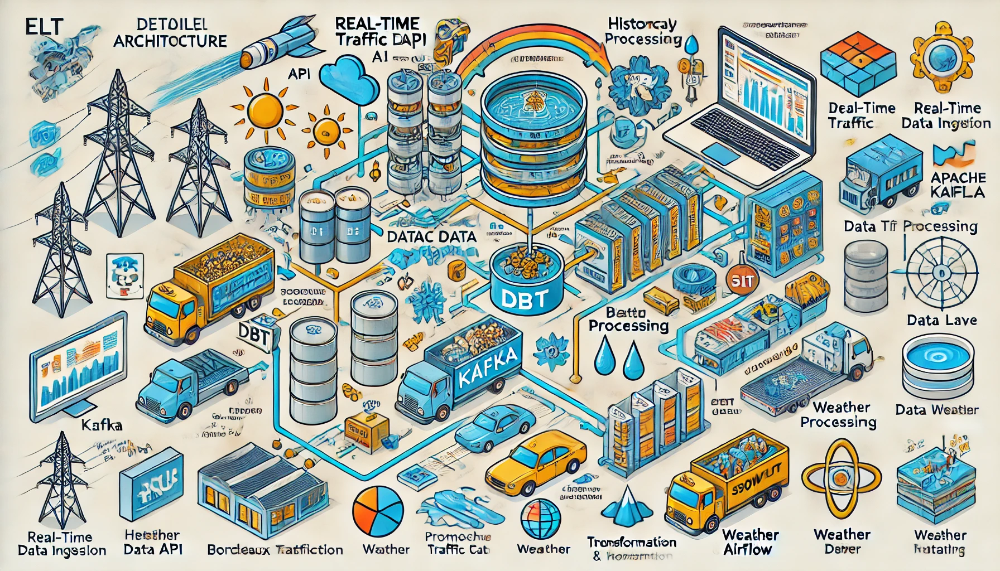
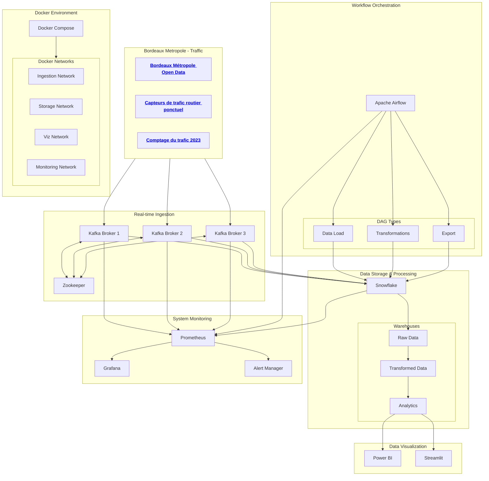

# 

The project consists of creating a data pipeline to study traffic jams in and around Bordeaux. The architecture is based on a **Docker** container composed by :

> - **Kafka** for real-time data streaming,
> - **Snowflake** for storage and transformation,
> - **Power BI/Streamlit** for interactive visualization.
> - **Grafana & Prometheuse** for performance tracking

During this upskilling journey we will :

### 📌 **1. Data sources**

- Real-time data\*\*: Live traffic API (Bordeaux Métropole Open Data).
- Aggregated data\*\*: Historical traffic counts (data.gouv.fr).
- Enriched data\*\*: OpenWeather API (weather), event data (disruptions).

---

### 🖀 **2. data ingestion and storage**: real time

#### **Real time: Kafka + DLT**

- **Kafka**: Captures real-time data from road traffic API.
- Kafka Connect + Delta Live Tables (DLT)\*\*: Continuous loading into Snowflake.
- Snowflake Storage\*\*: Separate tables for raw and transformed data.

#### **Historical and aggregated data: Airflow + DLT** \*\*Airflow DAGs

- Airflow DAGs\*\*: Scheduled execution to retrieve aggregated data.
- DLT\*\*: Initial storage in raw tables before transformation.

---

### 🔧 **3. Transformation and Modeling (DBT)**

- DBT transforms and cleans\*\* raw data.
- Creation of models\*\* for :
  - Traffic flows by zone and time.
  - Traffic/weather/events correlation.
  - Anomaly detection and prediction.

---

### 🚦 **4. Orchestration (Apache Airflow)**

- Triggers Airflow DAGs\*\* to :
  - Check API availability.
  - Launch Kafka/DLT pipelines.
  - Execute DBT transformations.
  - Refresh dashboards.

---

### 📊 **5. Visualization and Analytics**

- **Power BI**: Interactive dashboards with heat maps and trends.
- **Streamlit**: Web application with dynamic filters and simulations.

---

### 🔄 **6. Automation & Deployment**

- GitHub Actions\*\*: CI/CD to validate DBT models and Airflow workflows.
- Automated testing\*\* :
  - DBT tests\*\*: Check for constraints and anomalies.
  - Unit tests\*\* on Airflow DAGs.
  - Kafka monitoring\*\* with Prometheus/Grafana.

---

### 🏧 **Architecture diagram**

📌 **Real Time Flow**  
1⃣ API Bordeaux Métropole → 2⃣ Kafka → 3⃣ Snowflake (DLT) → 4⃣ DBT → 5⃣ Power BI/Streamlit

📌 **Flux Aggregates**  
1⃣ API Data.gouv.fr → 2⃣ Airflow → 3⃣ Snowflake → 4⃣ DBT → 5⃣ Power BI/Streamlit

📌 **Orchestration & Automation**

- Airflow orchestrates everything.
- GitHub Actions provides CI/CD.

---

**✅ Highlights:**

- ✔ Optimal management of real-time and historical data.
- ✔ Scalable architecture.
- ✔ Clear separation between ingestion, storage, transformation and visualization.
- ✔ Robust orchestration and automation.
