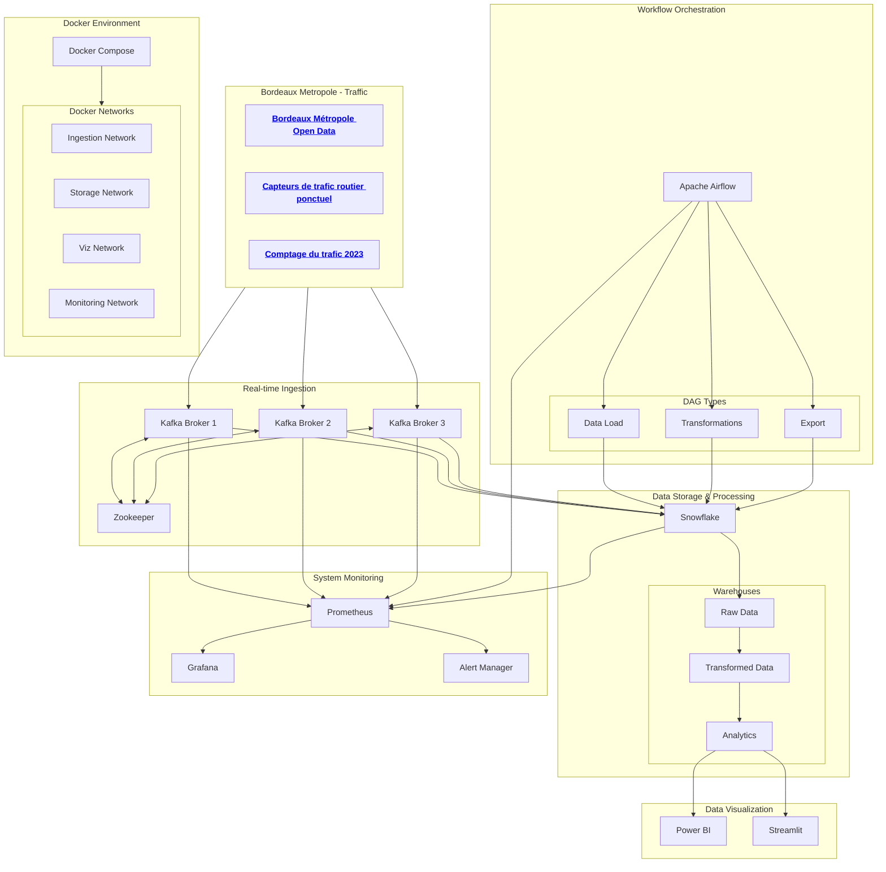

# 

The project consists of creating a data pipeline to study traffic jams in and around Bordeaux. The architecture is based on a **Docker** container composed by :

> - **Kafka** for real-time data streaming,
> - **Snowflake** for storage and transformation,
> - **Power BI/Streamlit** for interactive visualization.
> - **Grafana & Prometheuse** for performance tracking



## 📌 **1. Deploying services with Docker Compose**

Let's create a `docker-compose.yml` file to manage Kafka, Zookeeper, Airflow, DBT, Grafana and Prometheus.

```yaml
docker-compose.yml
version: '3.8'
services:
  zookeeper:
    image: confluentinc/cp-zookeeper
    environment:
      ZOOKEEPER_CLIENT_PORT: 2181

  kafka:
    image: confluentinc/cp-kafka
    depends_on:
      - zookeeper
    environment:
      KAFKA_BROKER_ID: 1
      KAFKA_ZOOKEEPER_CONNECT: zookeeper:2181
      KAFKA_ADVERTISED_LISTENERS: PLAINTEXT://kafka:9092
      KAFKA_OFFSETS_TOPIC_REPLICATION_FACTOR: 1

  airflow:
    image: apache/airflow:2.6.3
    environment:
      - AIRFLOW__CORE__EXECUTOR=LocalExecutor
    volumes:
      - ./dags:/opt/airflow/dags

  dbt:
    image: fishtownanalytics/dbt
    volumes:
      - ./dbt:/usr/app/dbt

  prometheus:
    image: prom/prometheus
    volumes:
      - ./prometheus.yml:/etc/prometheus/prometheus.yml
    ports:
      - "9090:9090"

  grafana:
    image: grafana/grafana
    ports:
      - "3000:3000"
    environment:
      - GF_SECURITY_ADMIN_PASSWORD=admin
    depends_on:
      - prometheus
```

Start services :

```sh
docker-compose up -d
```

Add Prometheus configuration (`prometheus.yml`) :

```yaml
scrape_configs:
  - job_name: "airflow"
    static_configs:
      - targets: ["airflow:8080"]
  - job_name: "kafka"
    static_configs:
      - targets: ["kafka:9092"]
```

---

## 🖀 **2. data ingestion and storage**

### **2.1 Creating a Kafka Topic**

```sh
docker exec -it kafka kafka-topics --create --topic traffic_data --bootstrap-server kafka:9092 --partitions 1 --replication-factor 1
```

### **2.2 Developing a Kafka Producer in Python**

Installation of :

```sh
pip install kafka-python requests
```

Producer code :

```python
from kafka import KafkaProducer
import requests
import json
import time

KAFKA_BROKER = "localhost:9092"
TOPIC = "traffic_data"
API_URL = "https://api.bordeaux-metropole.fr/traffic"

producer = KafkaProducer(
    bootstrap_servers=KAFKA_BROKER,
    value_serializer=lambda v: json.dumps(v).encode('utf-8')
)

while True:
    response = requests.get(API_URL)
    if response.status_code == 200:
        data = response.json()
        producer.send(TOPIC, data)
        print(f"Sent: {data}")
    time.sleep(10)  # Interrogation toutes les 10 sec
```

---

## **5. Monitoring with Grafana and Prometheus** **Prometheus**

> - Prometheus\*\* collects pipeline metrics (Kafka latencies, Airflow executions, DBT errors).
> - Grafana\*\* displays monitoring dashboards.

Launch Grafana :

```sh
docker-compose up grafana -d
```

### **Grafana configuration**

> - Access Grafana via `http://localhost:3000`.
> - Log in with `admin/admin`.
> - Add **Prometheus** as data source (`http://prometheus:9090`).
> - Create a dashboard to monitor Kafka, Airflow and Snowflake performance.

---

## **6. Integration with GitHub Actions**

### **6.1 GitHub Actions workflow configuration**

Add a `.github/workflows/elt_pipeline.yml` file:

```yaml
name: CI/CD ELT Pipeline

on:
  push:
    branches:
      - main
  pull_request:
    branches:
      - main

jobs:
  test:
    runs-on: ubuntu-latest
    steps:
      - name: Checkout du code
        uses: actions/checkout@v3

      - name: Configuration Python
        uses: actions/setup-python@v3
        with:
          python-version: "3.9"

      - name: Installation des dépendances
        run: |
          pip install -r requirements.txt

      - name: Exécuter les tests DBT
        run: |
          dbt test

  deploy:
    needs: test
    runs-on: ubuntu-latest
    steps:
      - name: Déploiement avec Docker Compose
        run: |
          docker-compose up -d
```

### **6.2 How it works**

> - **Automatic** triggering of push or pull requests on `main`.
> - **Checks**: unit tests, DBT tests.
> - **Automatic** deployment with `docker-compose` after validation.
