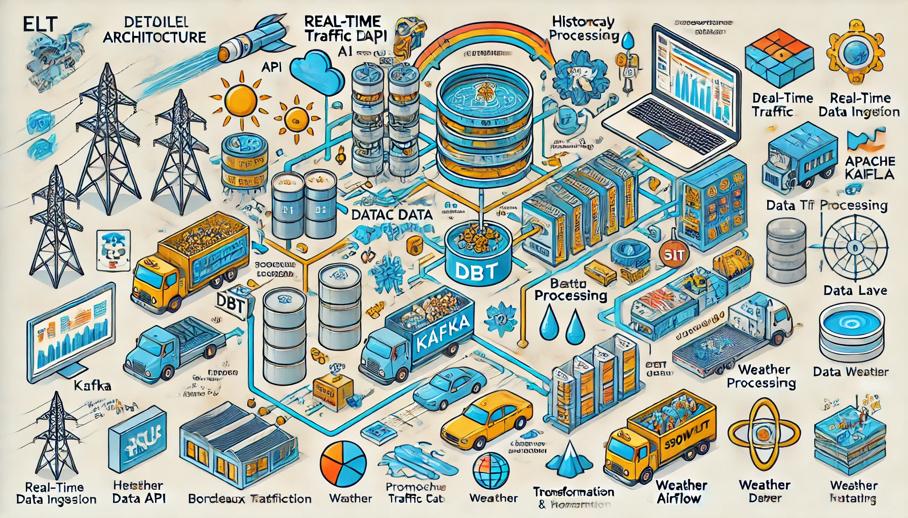

# 

The project consists of creating a data pipeline to study traffic jams in and around Bordeaux. The architecture is based on a **Docker** container composed by :

> - **Kafka** for real-time data streaming,
> - **Snowflake** for storage and transformation,
> - **Power BI/Streamlit** for interactive visualization.
> - **Grafana & Prometheuse** for performance tracking

### 📌 **1. Data sources**

#### **User Stories and related tasks**

- **US0**: Environment settings

  - [ ] Install docker and docker desktop
  - [ ] Clone the project
  - [ ] Install uv and create a virtual environment

- **US1**: Collect real-time data from the Bordeaux Métropole API to analyze live road traffic.

  - [ ] Identify API and analyze documentation
  - [ ] Implement a Python script to query the API continuously
  - [ ] Set up a Kafka producer to publish data

- **US2**: Retrieve historical data from data.gouv.fr to compare traffic trends.

  - [ ] Identify relevant datasets
  - [ ] Develop an extraction pipeline with Airflow
  - [ ] Store historical data in Snowflake

- **US3**: Enrich data with weather and event information.
  - [ ] Identify sources of weather information
  - [ ] Develop an API integration to retrieve this data
  - [ ] Join these data with traffic in Snowflake

---

### 🖀 **2. data ingestion and storage**

#### **User Stories and associated tasks**

- **US4**: Kafka captures data in real time to enable continuous ingestion.

  - [ ] Set up a Kafka cluster
  - [ ] Configure Kafka Connect to interface with Snowflake

- **US5**: Kafka Connect and Delta Live Tables (DLT) load data into Snowflake continuously.

  - [ ] Configure Snowflake as a sink for Kafka
  - [ ] Deploy DLT to transform and store raw data

- **US6**: Store raw and transformed data in separate tables.

  - [ ] Define table schema in Snowflake
  - [ ] Configure Snowflake to separate raw and transformed data.

- **US7**: Ingestion of historical and aggregated data via Airflow and DLT.
  - [ ] Develop an Airflow DAG to load historical data
  - [ ] Define a transformation model with DBT

---

### 🔧 **3. Transformation and Modeling (DBT)**

#### **User Stories and related tasks**

- **US8**: Transform and clean raw data with DBT.

  - [ ] Define DBT transformation models
  - [ ] Implement cleansing and validation rules

- **US9**: Create data models to analyze traffic flow.

  - [ ] Design analytical models in DBT
  - [ ] Implement data quality tests

- **US10**: Analyze the correlation between traffic, weather and events.

  - [ ] Define relevant metrics
  - [ ] Build analytical queries in Snowflake

- **US11**: Detect anomalies and predict future traffic.
  - [ ] Implement anomaly detection algorithms
  - [ ] Experiment with predictive models on data

---

### 🚦 **4. Orchestration (Apache Airflow)**

#### **User Stories and related tasks**

- **US12**: Orchestrate data ingestion and transformation with Airflow.

  - [ ] Define tasks and dependencies in Airflow
  - [ ] Set up logs and alerts

- **US13**: Check API availability before launching the pipeline.

  - [ ] Add an API pre-check task
  - [ ] Manage errors and automatic retries

- **US14**: Execute Kafka/DLT and DBT workflows and refresh dashboards.
  - [ ] Schedule execution of Airflow DAGs
  - [ ] Integrate dashboard updates

---

### 📊 **5. Visualization and Analytics**

#### **User Stories and related tasks**

- **US15**: Visualize real-time traffic data on Power BI.

  - [ ] Connect Power BI to Snowflake
  - [ ] Create an interactive heat map

- **US16**: Use Streamlit to interactively explore traffic trends.

  - [ ] Develop an interactive dashboard with Streamlit
  - [ ] Add relevant filters and visualizations

- **US17**: View traffic statistics over different time periods.
  - [ ] Define key performance indicators (KPIs)
  - [ ] Design time charts

---

### 🔄 **6. Automation & Deployment**

#### **User Stories and related tasks**

- **US18**: GitHub Actions automatically validates DBT templates and Airflow workflows.

  - [ ] Set up a CI/CD pipeline
  - [ ] Add unit and integration tests

- **US19**: Check DBT for constraints and anomalies.

  - [ ] Define validation tests on data
  - [ ] Automate test execution with GitHub Actions

- **US20**: Monitor Kafka with Prometheus/Grafana.
  - [ ] Install Prometheus and Grafana
  - [ ] Set up problem alerts

---

### 🏧 **Architecture schematic**

📌 **Real Time Flow**  
1⃣ API Bordeaux Métropole → 2⃣ Kafka → 3⃣ Snowflake (DLT) → 4⃣ DBT → 5⃣ Power BI/Streamlit

📌 **Flux Aggregates**  
1⃣ API Data.gouv.fr → 2⃣ Airflow → 3⃣ Snowflake → 4⃣ DBT → 5⃣ Power BI/Streamlit

📌 **Orchestration & Automation**

- Airflow orchestrates everything.
- GitHub Actions provides CI/CD.

---
